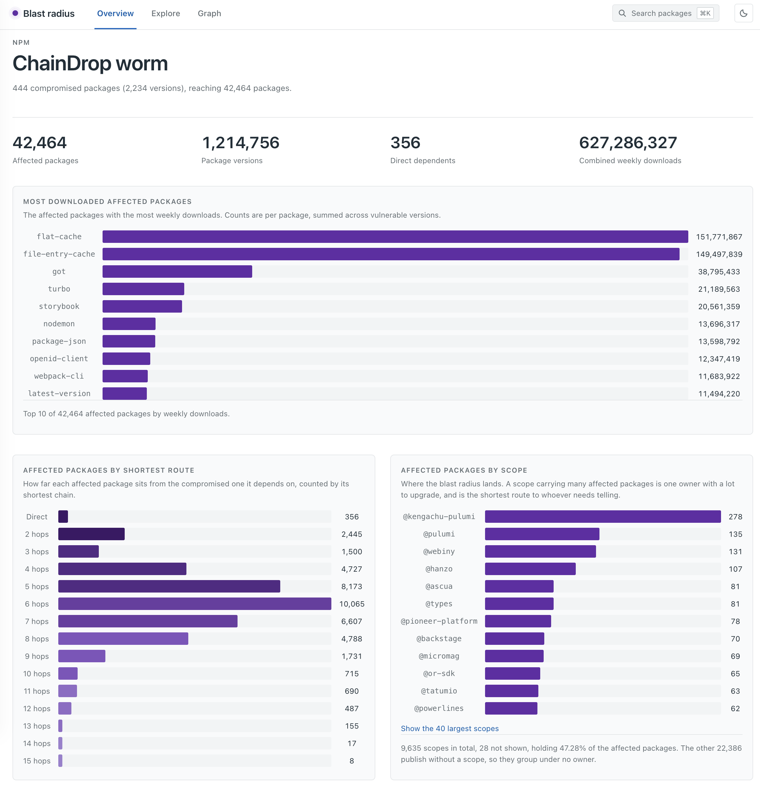
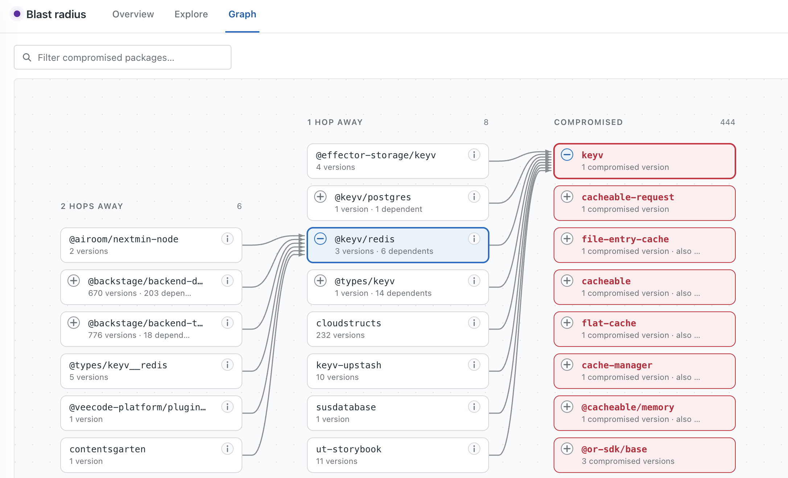
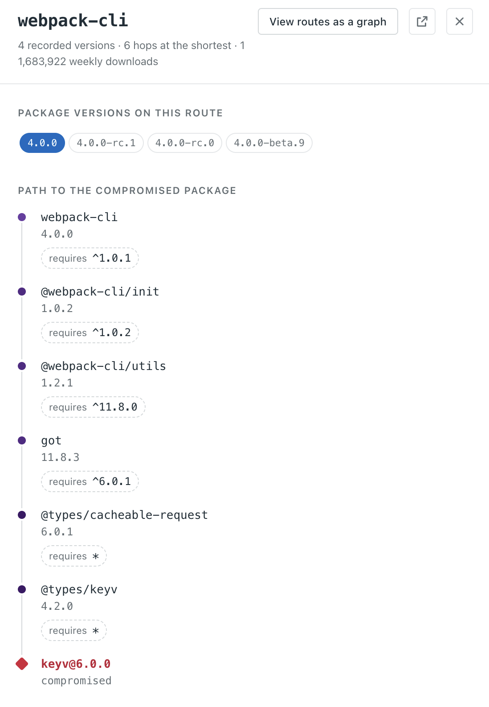
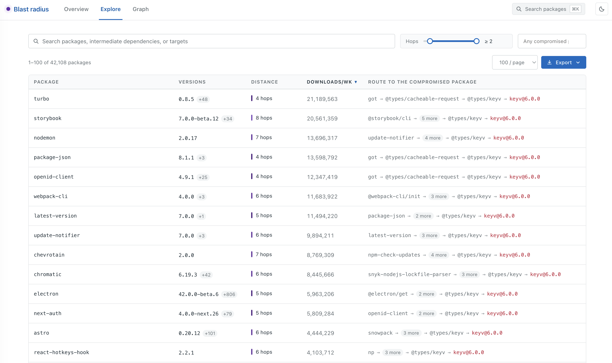

# Investigate the blast radius of compromised packages

`blast-radius` analyzes the blast radius of a compromised dependency. When a legitimate package gets compromised (for instance, [axios](https://securitylabs.datadoghq.com/articles/axios-npm-supply-chain-compromise/) versions 1.14.1 and 0.30.4), one question is hard to answer: **which packages, if installed during the compromise window, could have pulled in the malicious version?**

Give `blast-radius` a package name and version, even a yanked one, and it finds every package whose declared version range could resolve to it. The tool queries a local snapshot of the [deps.dev](https://deps.dev) dependency graph, which Google publishes as a BigQuery public dataset.

<table>
  <tr>
    <td width="50%" align="center"><a href="demo/dashboard-1.png"></a><br><sub><b>Overview</b>: blast-radius summary, hops histogram & top scopes</sub></td>
    <td width="50%" align="center"><a href="demo/dashboard-2.png"></a><br><sub><b>Explore</b>: interactive dependency graph around the compromise</sub></td>
  </tr>
  <tr>
    <td width="50%" align="center"><a href="demo/dashboard-3.png"></a><br><sub><b>Route</b>: path from a package down to the compromised version</sub></td>
    <td width="50%" align="center"><a href="demo/dashboard-4.png"></a><br><sub><b>Affected packages</b>: searchable table of the full blast radius</sub></td>
  </tr>
</table>

## Sample usage

In July 2026, version 3.3.1 of the `@asyncapi/generator` package was compromised. Using `blast-radius`, we can find all transitive dependencies of this package that don't lock versions and could end up installing the malicious package.

```
$ blast-radius analyze npm @asyncapi/generator 3.3.1  --depth 10 --enrich-with-download-count

Computing blast radius for @asyncapi/generator@3.3.1 (NPM), depth=10

Depth 1: querying dependents of 1 package(s)...
Depth 1: scanned 1459 edges, found 89 new affected packages
Depth 2: querying dependents of 8 package(s)...
Depth 2: scanned 93 edges, found 93 new affected packages
Depth 3: querying dependents of 2 package(s)...
Depth 3: scanned 0 edges, found 0 new affected packages

Total: 182 affected versions (10 unique packages)
Enriching 10 unique packages with download counts...

Blast radius for @asyncapi/generator@3.3.1 (NPM)
Total dependency edges scanned: 1,552
Affected: 182 versions (10 unique packages)
Max depth: 10 | Took 1.2s

PACKAGE                                                      VERSION  DEPTH  DOWNLOADS/wk  PATH
@asyncapi/cli                                                5.0.5    1      55,458        @asyncapi/cli@5.0.5 ──(^3.0.1)──▶ @asyncapi/generator@3.3.1
@powerlines/plugin-asyncapi                                  0.1.646  2      3,116         @powerlines/plugin-asyncapi@0.1.646 ──(^0.0.59)──▶ @power-plant/asyncapi@0.0.59 ──(^3.3.0)──▶ @asyncapi/generator@3.3.1
@power-plant/asyncapi                                        0.0.29   1      2,200         @power-plant/asyncapi@0.0.29 ──(^3.3.0)──▶ @asyncapi/generator@3.3.1
@bymbly/api-tools                                            1.4.63   2      550           @bymbly/api-tools@1.4.63 ──(6.0.2)──▶ @asyncapi/cli@6.0.2 ──(^3.2.0)──▶ @asyncapi/generator@3.3.1
@nmime/nestjs-asyncapi                                       2.0.5    1      327           @nmime/nestjs-asyncapi@2.0.5 ──(^3.1.0)──▶ @asyncapi/generator@3.3.1
asyncapi-mcp-server                                          3.0.0    1      8             asyncapi-mcp-server@3.0.0 ──(^3.2.1)──▶ @asyncapi/generator@3.3.1
@asyncapi-actions-test/trusted-publishing-test_asyncapi-cli  5.3.0    1      3             @asyncapi-actions-test/trusted-publishing-test_asyncapi-cli@5.3.0 ──(^3.0.1)──▶ @asyncapi/generator@3.3.1
@achinet/nestjs-async                                        0.2.0    1      2             @achinet/nestjs-async@0.2.0 ──(^3.1.2)──▶ @asyncapi/generator@3.3.1
@leandrose/project-documentation                             0.2.1    1      1             @leandrose/project-documentation@0.2.1 ──(^3.2.1)──▶ @asyncapi/generator@3.3.1
trusted-publishing-test_asyncapi-cli                         4.1.3    1      1             trusted-publishing-test_asyncapi-cli@4.1.3 ──(^3.0.1)──▶ @asyncapi/generator@3.3.1

Saved to output/2026-08-05_160650/
  blast-radius.json      full report
  affected-packages.csv  10 packages
  paths.csv              182 rows

Browse the results with:
  blast-radius visualize output/2026-08-05_160650/blast-radius.json
```

## How it works

1. `blast-radius` pulls the [deps.dev BigQuery dataset](https://docs.deps.dev/bigquery/v1/) into local Parquet files and imports them into a single local DuckDB database, containing direct dependency edges (package -> dependency + version range).
2. It queries the database, filtering edges where the declared version range includes the target version (for example, npm `^1.6.1` matches `1.14.1`, and PyPI `>=1,<2` matches `1.14.1`).
3. If the local database has weekly download counts, it applies them offline. PyPI databases can include those counts at ingestion time with `download-data --include-download-counts`. npm counts are optional report-time enrichment from the npm downloads API (`--enrich-with-download-count`). npm compromised-version registry metadata is also available (`--enrich-compromised-package-metadata`, disabled by default).

This works even for **yanked or removed versions**, because `blast-radius` checks the declared range rather than what the registry currently resolves to.

Supported ecosystems:

| ecosystem | CLI name | version rules | notes |
| --- | --- | --- | --- |
| npm | `npm` | npm semver ranges | Supports npm download-count enrichment and bundled-dependency handling. |
| PyPI / pip | `pypi` (`pip` alias) | PEP 440 specifiers | Supports ingestion-time BigQuery download counts; reports resolver-time exposure, not lockfile proof. |

## Setup

### Prerequisites

- Go 1.25+
- A Google Cloud account, authenticated using `gcloud auth login --update-adc`

### Overview of the `blast-radius` CLI

One binary provides all three subcommands:

| command | purpose |
| --- | --- |
| `blast-radius download-data` | export the dependency graph from BigQuery and build the local database |
| `blast-radius analyze` | compute the blast radius of one or more compromised versions |
| `blast-radius visualize` | browse a generated JSON report in a local web UI |
| `blast-radius enrich-download-count` | add weekly download counts to a saved report, in place |

### Step 1: Get the data

The dependency graph snapshot comes from the [deps.dev BigQuery public dataset](https://docs.deps.dev/bigquery/v1/). Download it once with `blast-radius download-data`; you won't need to repeat this for every analysis. It persists around 20 GB of files on your machine, so make sure you have enough disk space available.

> [!TIP]  
> If you want to test blast-radius on demo data, you can skip to [Step 2](#step-2-analyze-the-data) and use one of the following demo files as an input:
> - `./demo/chaindrop-worm.json.gz` (dependency snapshot date: 2026-08-03, download counts as of 2026-08-10)
> - `./demo/axios-compromise.json.gz` (dependency snapshot date: 2026-03-30, download counts as of 2026-08-11)


`blast-radius download-data`:
- creates a BigQuery table in your Google Cloud project (around 20 GB, expected monthly cost < $1)
- queries the BigQuery table and exports it (one-time cost ~$10)
- queries the same BigQuery dataset for each package version's publish date and exports that too (a second, separately-priced query, typically well under $1), which lets `blast-radius` reason about bundled dependencies (see "Bundled npm dependencies" above)
- optionally, for PyPI only, queries `bigquery-public-data.pypi.file_downloads` for the last seven complete days and exports package-level download counts (`--include-download-counts`)
- exports the tables as Parquet files into a Google Cloud Storage (GCS) bucket (around 10 GB, expected monthly cost < $1)
- downloads the Parquet files to your machine
- builds a local DuckDB instance (single, self-contained file) from them
- removes the Parquet files from your machine


The command typically takes 20-30 minutes to complete. 

Usage:


```bash
blast-radius download-data npm --project <your-gcp-project>

# or, for PyPI / pip
blast-radius download-data pypi --project <your-gcp-project> --include-download-counts
```

Sample output:

```
project dd-security-research   snapshot 2026-08-03 (latest)

[1/4] Bucket
      gs://dd-security-research-blast-radius does not exist
      Create it in US? [y/N] y
      created

[2/4] Export query
      destination  dd-security-research:blast_radius.npm_edges
      scan size    1.39 TiB
      cost         ~$8.69   on-demand, $6.25/TiB
      Proceed? [y/N] y
      query        job_3WAX65RHz6AgedIZTvcpBaUjwfu1  done in 16s
      extract      job_qf_SPET85Tr74pPddnQqmOEg0akh  done in 6s
      wrote        gs://dd-security-research-blast-radius/blast-radius/2026-08-03/npm-edges-*.parquet
      destination  dd-security-research:blast_radius.npm_versions
      scan size    0.09 TiB
      cost         ~$0.56   on-demand, $6.25/TiB
      Proceed? [y/N] y
      query        job_9k1Zc1RHz6AgedIZTvcpBaUjw2   done in 9s
      extract      job_bT_LMET85Tr74pPddnQqmOEg1a  done in 4s
      wrote        gs://dd-security-research-blast-radius/blast-radius/2026-08-03/npm-versions-*.parquet

[3/4] Download
      1000 shards to data/parquet/2026-08-03
       200/1000    2.1 GB
       ...
      1000/1000   10.1 GB   in 1m12s

[4/4] Build
      data/npm-deps.duckdb from 1000 shards, this takes several minutes
      still building, 30s elapsed
      done in 1m47s

Done in 3m41s
      database     data/npm-deps.duckdb
      rows         419,092,480
      size         18.3 GB
      shards       removed from data/parquet/2026-08-03 (--keep-parquet keeps them)

Next
      blast-radius analyze npm <package> <version>
```


### Step 2: Analyze the data

Sample usage:

```bash
blast-radius analyze npm axios 1.14.1

# PyPI / pip uses PEP 440 version specifiers from package metadata. If the
# database was built with --include-download-counts, this also ranks by local
# BigQuery-derived last-week download counts with no registry calls.
blast-radius analyze pypi requests 2.32.0

# Rank by weekly download counts (slower, might hit rate limits if the result count is high)
blast-radius analyze npm axios 1.14.1 --enrich-with-download-count

# Add npm registry metadata for the compromised version itself. For a removed
# version, this reports "removed no later than" the package's registry modified
# timestamp.
blast-radius analyze npm axios 1.14.1 --enrich-compromised-package-metadata

# Download counts hit the npm registry, which rate-limits per IP behind
# Cloudflare. Registry metadata uses the same token when present. Set NPM_TOKEN
# to lift the unauthenticated limit:
NPM_TOKEN=$(cat ~/.npm-token) blast-radius analyze npm axios 1.14.1 --enrich-with-download-count --enrich-compromised-package-metadata

# Find transitive dependencies up to a depth of 5
blast-radius analyze npm axios 1.14.1 --depth 5

# Multiple compromised versions
blast-radius analyze npm axios --versions 1.14.1,0.30.0

# Many compromised packages at once via a CSV.
cat > compromised.csv <<'EOF'
axios;1.14.1,0.30.4
lodash;4.17.20,4.17.21
EOF
blast-radius analyze npm --csv compromised.csv --depth 3
```

For PyPI, package names are normalized the same way pip normalizes project
names: case is ignored, and runs of `_`, `.`, or `-` collapse to `-`.

PyPI results answer whether published package metadata contains a transitive
path whose specifiers could permit the compromised version. They do not prove
that every `pip install <package>` deterministically installs that exact
version: pip's resolver also considers the complete dependency set, Python
version, platform markers, extras, already installed packages, indexes,
constraints, and upgrade strategy.

For Poetry and uv, this analysis applies before or during dependency
resolution. If a project installs from `poetry.lock` or `uv.lock`, the lockfile
pins transitive dependencies; proving exposure then requires inspecting that
lockfile or an SBOM, not just package metadata ranges.

Every run writes its full results to `output/<YYYY-MM-DD_HHMMSS>/`.

| file | contents |
| --- | --- |
| `blast-radius.json` | the full report |
| `affected-packages.csv` | `package_name,vulnerable_versions`, one row per unique package |
| `paths.csv` | one row per affected version, with depth, downloads, target metadata and path |

#### Adding download counts to a saved report

If you ran `analyze` without `--enrich-with-download-count` (or a previous
enrichment was interrupted), `enrich-download-count` adds the counts to an
existing output folder in place, reusing the same paced, rate-limit-aware logic:

```bash
# Enrich a previous run's output folder (only packages still missing a count)
NPM_TOKEN=$(cat ~/.npm-token) blast-radius enrich-download-count output/2026-08-10_095042

# Re-fetch every package to refresh stale counts
blast-radius enrich-download-count output/2026-08-10_095042 --force

# Slow the request pace if you hit 429s
blast-radius enrich-download-count output/2026-08-10_095042 --rate 1
```

The npm downloads API rate-limits per IP, so npm requests are paced (`--rate`,
default 1 req/s, 4 workers) and back off together on 429. Without `NPM_TOKEN` an
npm run is best-effort and much slower; the command prints a warning. PyPI
download counts are not fetched from a registry API; use
`download-data pypi --include-download-counts` when building a fresh database to
import last-week counts from BigQuery and keep analysis offline.

### Step 3: Visualize the data

Spin up a graphical interface to explore the data:

```bash
blast-radius visualize output/2026-08-05_160650/blast-radius.json
```


## Development

```bash
make            # builds bin/blast-radius
make test       # run the unit tests
make vet        # run go vet
make clean      # remove bin/
```

## Additional notes and known limitations

### Multi-target path attribution

When analyzing multiple compromised packages or versions in one run, `blast-radius` currently keeps one path per affected package version. If the same package version can reach more than one compromised target, the report records the first matching target and path it finds, and later matching targets are not shown for that package version.

The package version is still reported as affected, but `blast-radius.json` and
`paths.csv` may not list every compromised target it could resolve to.

### What the viewer shows

`blast-radius visualize` reads one report and never re-runs the analysis, so
everything it shows inherits the limitation above. Specifically:

- Routes and targets are the ones **recorded by the analyzer**, not every
  dependency path that exists.
- Each affected `package@version` carries exactly one recorded path, because
  traversal dedupes globally on `name@version`.
- Target counts are **attribution** counts. A package attributed to one target
  is not proof that no other target reaches it.
- Version lists summarise **recorded** versions. They are a sparse set, not a
  continuous version range, and versions the traversal did not reach are absent.
- Combined weekly downloads sums per-package counts, so consumers shared
  between two affected packages are counted twice. A report that was never
  enriched shows "not enriched" rather than 0.
- The graph aggregates nodes by package name, so several compromised versions
  of one package share a single node.
- The traced-package graph draws the 30 shortest routes and says how many more
  are recorded. One package in the test corpus has 242.

### How `blast-radius` handles bundled npm dependencies

npm packages can freeze dependencies directly into their tarball with `bundleDependencies` or `bundledDependencies`. deps.dev records each package inside that frozen subtree with a synthetic name, for example:

```text
cloudstructs>0.6.11>@types/keyv
```

`cloudstructs@0.6.11` bundled a dependency tree containing `@types/keyv`. The synthetic name preserves the bundling root and the bundled package, but drops every intermediate package in between.

`blast-radius` treats each of these rows as a candidate for the bundling root package, labels its path step `bundled`, and applies a publish-date check:

- If the bundling root was published before the compromised target version existed, `blast-radius` drops the edge: the root's tarball could not have frozen in a version that didn't exist yet.
- If the root was published on or after the target version, or either publish date is missing, `blast-radius` keeps the edge.

For example, `cloudstructs@0.6.11` was published on 2022-11-01, and `keyv@6.0.0` was published on 2026-08-04. A 2022 tarball cannot contain a 2026 package version, so `blast-radius` excludes a direct bundled hit on `keyv@6.0.0` when both publish dates are known. If the local `versions` table predates the target version and has no date for `keyv@6.0.0`, `blast-radius` keeps the result instead, conservatively.

This check only proves whether the compromised target version existed yet when the bundling root was published. It does not reconstruct the exact frozen tree. Treat bundled rows as candidates, not certainties, and verify them against the published tarball when exact attribution matters.

Publish dates come from the optional `PackageVersions` export in `blast-radius download-data`. Older databases without that table keep every bundled candidate, since their publish dates are unknown.
